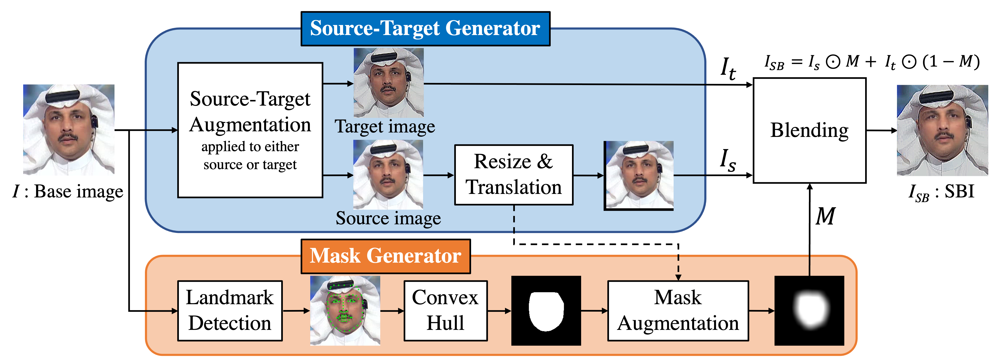

# Detecting Deepfakes with Self-Blended Images
  
The official PyTorch implementation for the following paper: 
> [**Detecting Deepfakes with Self-Blended Images**](https://arxiv.org/abs/2204.08376),  
> Kaede Shiohara and Toshihiko Yamasaki,  
> *CVPR 2022 Oral*


# License
Our code and pretrained model are freely available for research purpose.  
For commercial use: 
- A license agreement is required. 
- See the [license](https://github.com/mapooon/SelfBlendedImages/blob/master/LICENSE) for more details and contact the author [Kaede Shiohara](mailto:shiohara@cvm.t.u-tokyo.ac.jp).


# Recomended Development Environment
* GPU: NVIDIA A100
* CUDA: 11.1
* Docker: 20.10.8


# Setup
## 1. Dataset
Download datasets and place them in `./data/` folder.  
For example, download [Celeb-DF-v2](https://github.com/yuezunli/celeb-deepfakeforensics) and place it:
```
.
└── data
    └── Celeb-DF-v2
        ├── Celeb-real
        │   └── videos
        │       └── *.mp4
        ├── Celeb-synthesis
        │   └── videos
        │       └── *.mp4
        ├── Youtube-real
        │   └── videos
        │       └── *.mp4
        └── List_of_testing_videos.txt
```
For other datasets, please refer to `./data/datasets.md` .


## 2. Pretrained model
We provide pretrained EfficientNet-B4.  
Download [here](https://drive.google.com/file/d/12sLyqBp0VFwdpA-oZLdIOkOTkz_ZnIhV/view?usp=sharing) and place it in `./weights/` folder.

## 3. Docker
1. Replace the absolute path to this repository in `./exec.sh` .
2. Run the scripts:
```bash
bash build.sh
bash exec.sh
```


# Test
For example, run the inference on Celeb-DF-v2:
```bash
CUDA_VISIBLE_DEVICES=* python3 src/inference/inference_dataset.py \
-w weights/sbi.tar \
-d CDF
```
The result will be displayed.

Using the provided pretrained model, our cross-dataset results are reproduced as follows:

CDF | DFD | DFDC | DFDCP | FFIW
:-: | :-: | :-: | :-: | :-:
93.82% | 97.87% | 73.01% | 85.70% | 84.52%


We also provide an inference code for video:
```bash
CUDA_VISIBLE_DEVICES=* python3 src/inference/inference_video.py \
-w weights/sbi.tar \
-i /path/to/video.mp4
```
and for image:
```bash
CUDA_VISIBLE_DEVICES=* python3 src/inference/inference_image.py \
-w weights/sbi.tar \
-i /path/to/image.png
```

# Training
1. Download [FF++](https://github.com/ondyari/FaceForensics) real videos and place them in `./data/` folder:
```
.
└── data
    └── FaceForensics++
        ├── original_sequences
        │   └── youtube
        │       └── raw
        │           └── videos
        │               └── *.mp4
        ├── train.json
        ├── val.json
        └── test.json
```
2. Download landmark detector (shape_predictor_81_face_landmarks.dat) from [here](https://github.com/codeniko/shape_predictor_81_face_landmarks) and place it in `./src/preprocess/` folder.  

3. Run the two codes to extractvideo frames, landmarks, and bounding boxes:
```bash
python3 src/preprocess/crop_dlib_ff.py -d Original
CUDA_VISIBLE_DEVICES=* python3 src/preprocess/crop_retina_ff.py -d Original
```

4. (Option) You can download code for landmark augmentation:
```bash
mkdir src/utils/library
git clone https://github.com/AlgoHunt/Face-Xray.git src/utils/library
```
Even if you do not download it, our training code works without any error. (The performance of trained model is expected to be lower than with it.)

5. Run the training:
```bash
CUDA_VISIBLE_DEVICES=* python3 src/train_sbi.py \
src/configs/sbi/base.json \
-n sbi
```
Top five checkpoints will be saved in `./output/` folder. As descrived in our paper, we use the latest one for evaluations.

# Citation
If you find our work useful for your research, please consider citing our paper:
```bibtex
@misc{shiohara2022detecting,
      title={Detecting Deepfakes with Self-Blended Images}, 
      author={Kaede Shiohara and Toshihiko Yamasaki},
      year={2022},
      eprint={2204.08376},
      archivePrefix={arXiv},
      primaryClass={cs.CV}
}
```